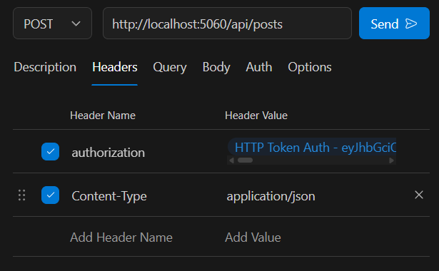

in this project we covring microsevices with Node.js (for better view, open in any code editor)
====================================================
pres req :- 
npm init
npm i nodemon express jsonwebtoken cors dotenv prisma @prisma/client
npx prisma init
npx prisma generate
----------------------
in package.json 
  "type": "module",
  "scripts": {
    "start": "node src/server.js",
    "dev": "nodemon src/server.js"
  },

  npm run dev

.env file
---------------
PORT=5050
DATABASE_URL="prisma+postgres://localhost:51213/?-----get it from your db "
JWT_SECRET_KEY=supersecretdfghjkl_auth_key_change_mesdfghjk

auth_micro/
 ├── prisma/
 │    └── schema.prisma        # Prisma schema for User (MongoDB)
 ├── src/
 │    ├── config/
 │    │    └── index.js        # Load env variables
 |    |    └── prismaClient.js
 │    ├── controllers/
 │    │    └── auth.controller.js
 │    ├── middlewares/
 │    │    └── auth.middleware.js  # (optional)
 │    ├── Services 
 |    |    └── auth.service.js           
 │    ├── routes/
 │    │    └── index.js
 │    ├── utils/
 │    │    └── jwt.js
 │    └── server.js
 ├── .env
 ├── package.json
 └── nodemon.json

post_micro/
 ├── prisma/
 │    └── schema.prisma              # Prisma schema for Post (MongoDB)
 ├── src/
 │    ├── config/
 │    │    ├── index.js              # loads env (PORT, DB URL)
 │    │    └── prismaClient.js       # Prisma client instance
 │    ├── controllers/
 │    │    └── post.controller.js    # request handlers
 │    ├── middlewares/
 │    │    └── auth.middleware.js    # verify JWT from auth_micro
 │    ├── routes/
 │    │    └── index.js              # all post routes
 │    ├── services/
 │    │    └── post.service.js       # business logic for posts
 │    ├── utils/
 │    │    └── response.js           # helper (format responses)
 │    └── server.js                  # app entry
 ├── .env
 ├── package.json
 └── nodemon.json

API's Test
server-1
--------
post req- http://localhost:5050/api/register
post req- http://localhost:5050/api/login
server-2
--------
post req- http://localhost:5060/api/posts
need to pass two headers

